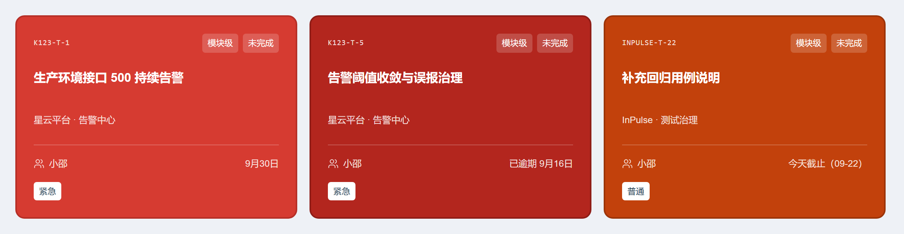
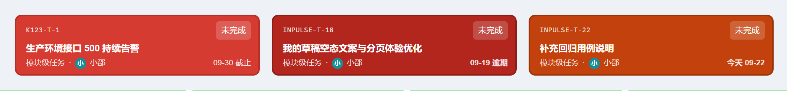

# 任务卡片配色规范

> 状态：阶段 0 实施中。本文件描述前端任务卡片的视觉取值，只记录已落库的实现事实，不改变接口、契约、数据库与权限矩阵。改色值时必须同步更新本文件、[测试矩阵](./test-matrix.md) 的《任务卡片实色配色》章节与 [开发日志](../开发日志.md)。

产品反馈「任务卡片不够醒目」后，卡片从浅色底改为按优先级铺实色（D2 方案）；「高」的底色经两轮候选对比后定为明黄 `#ffdb4d` + 深棕字。以下色值取自 `apps/web/src/styles/design-system.css` 末尾的「任务卡片醒目配色」块，选择器为 `:is(.calm-task-card, .tb-card).tone-prio-*`，比列表行用的 `.tone-prio-*` 高一级，因此只作用于卡片。任务看板的「已完成」另有一条 `.tb-card.tone-prio-done` 覆盖块，见下文《「已完成」：任务中心与看板分色》。已逾期与马上到期另有两档红、同样整卡铺色，色值写在同块后面的 `.tone-prio-overdue` / `.tone-prio-soon` 里，见下文《逾期与马上到期：三档整卡红》。

## 六种程度的卡片取值

| 程度 | tone 类名 | 卡片底色 | 描边 | 悬停底色 | 卡内文字 | 文字对比度 |
| --- | --- | --- | --- | --- | --- | --- |
| 紧急 | `tone-prio-urgent` | `#d63b31` | `#b62f27` | `#c8342b` | `#ffffff` | 4.6:1 |
| 高 | `tone-prio-high` | `#ffdb4d` | `#d6b841` | `#edcc48` | `#3f2d00` | 9.8:1 |
| 普通 | `tone-prio-normal` | `#0f6ae8` | `#0a55bd` | `#0c5ed4` | `#ffffff` | 4.9:1 |
| 低 | `tone-prio-low` | `#ffffff` | `#d9e0e7` | `#f5f8fa` | 继承深色正文 | 常规 |
| 已完成 | `tone-prio-done` | `#cdf1d3` | `#a3d9b0` | `#c0ebc7` | `#2f4031` | 9.0:1 |
| 已取消 | `tone-prio-canceled` | `#f2f5f8` | `#d5dde4` | `#e8edf1` | 继承深色正文 | 常规 |

说明：

- 对比度为白字或深棕字对实色底的计算值，六种程度的取字都在 WCAG AA 正常文字门槛（4.5:1）之上，没有已知取舍项。「高」原本用土黄 `#c47b00` + 白字只有 3.4:1，换成明黄 + 深棕字后达到 9.8:1；「已完成」原本用 `#2f9a68` + 白字只有 3.5:1、换成 `#12875f` 又偏沉，最终定为极浅嫩绿 `#a8e6b0` + 深绿字 `#2f4031`（7.7:1），2026-09-22 逐轮放淡到 `#cdf1d3`（9.0:1）；同日一度整体改到更浅的 `#eef8f3`，产品随后要求「任务中心的颜色改为原来的，任务看板的用当前这个颜色」，因此改为分色：任务中心与项目任务面板用 `#cdf1d3`，任务看板单独用 `#eef8f3`（10.2:1），深绿字两处共用。
- 「低」用白底、「已取消」用浅灰底，都不铺优先级实色，避免低优先级抢占注意力；白底卡靠 2px 描边与页面底色区分。
- 卡片统一 2px 描边，且不再显示左侧色条（`::before { display: none }`）——底色本身已表达优先级，多一条深色竖边在实色卡上显脏。描边统一取比底色深一档的色（紧急 `#d63b31`/`#b62f27`、高 `#ffdb4d`/`#d6b841`、普通 `#0f6ae8`/`#0a55bd`、已完成 `#cdf1d3`/`#a3d9b0`），浅底卡才不会看起来没有边框。
- 完成态覆盖优先级：「已完成」一律转绿、「已取消」一律转灰，即 `taskToneOf` 先判 `workStatus` 再判优先级。「已完成」只在「已完成」视图内出现，绿色只表达完成语义、不参与优先级辨识，因此取最浅最亮的一档。

## 「已完成」：任务中心与看板分色

2026-09-22 产品要求「任务中心的颜色改为原来的，任务看板的用当前这个颜色」，「已完成」因此不再一套色值走到底，按表面拆成两档（卡内深绿字与其余 `--task-ink-*` 取色两处共用）：

| 表面 | 选择器 | 卡片底色 | 描边 | 悬停底色 | 文字对比度 |
| --- | --- | --- | --- | --- | --- |
| 任务中心 `/tasks`、项目任务面板 | `:is(.calm-task-card, .tb-card).tone-prio-done` | `#cdf1d3` | `#a3d9b0` | `#c0ebc7` | 9.0:1 |
| 任务看板 `/projects/:id/task-board` | `.tb-card.tone-prio-done` | `#eef8f3` | `#d4e8dd` | `#ddf0e5` | 10.2:1 |

- 两个选择器权重相同（`:is()` 取参数里最高的 class 权重，与 `.tb-card.tone-prio-done` 都是两个 class），看板覆盖块写在基础块之后，靠源码顺序生效。
- 看板只覆盖 `--task-bg` / `--task-bd` / `--task-hov` 三个值，卡内文字沿用基础块的 `--task-ink-*`，不需要维护第二套深绿字。
- 看板这一档 `#eef8f3` 与列表行 / 表格行的「已完成」浅色同值：看板卡片本身就是浅底深字，取这一档与相邻的列表视图同族。
- 2026-09-22 同日补：任务中心这一档的描边原来是 `#ddf4e1`，比底色 `#cdf1d3` 还浅，卡片的 2px 边框视觉上等于不存在（产品看落地卡时问「这个要不也加个边框」）。现在改成与其余实色卡同口径的「描边比底色深一档」`#a3d9b0`：对底色的对比度 1.31:1，与「紧急」的 1.32:1、「普通」的 1.39:1 同一档；看板那一档的 `#d4e8dd` 本来就比 `#eef8f3` 深（1.18:1），维持不动。

## 卡内其余元素的取色

白字组（紧急 / 普通）与深字组（高 / 已完成）除正文外还统一处理编号、meta、徽章、日期与勾选；深字组的颜色统一由 `--task-ink-*` 变量驱动，两张浅底卡只在各自色值块里给变量赋值：

| 元素 | 白字组（紧急 / 普通） | 深字组（高 / 已完成） |
| --- | --- | --- |
| 标题 | `#ffffff` | `--task-ink`（高 `#3f2d00`、已完成 `#2f4031`） |
| 正文 / meta / 日期 | `#ffffffd9` | `--task-ink-soft`（同色 80%） |
| 底部行的分隔线 | `#ffffff3d` | `--task-ink-divider`（同色 20%） |
| 普通徽章底 | `#ffffff2e` | `--task-ink-badge`（同色 12%） |
| 优先级徽章 | 与同排标签同款：半透明白底 + 白字 | 与同排标签同款：`--task-ink-badge` + `--task-ink` |
| 遗留问题徽章 | 固定深锈红 `#8a2b06` + 白字（8.6:1），不受卡内统一反白影响 | 同左 |
| 悬停描边 | `#ffffff66` | `--task-ink-edge`（同色 40%） |
| 逾期 / 马上到期日期 | 整卡改铺 `#b3261e` / `#c2410c`，卡内文字仍在白字组里反白，没有单独的日期签 | 同左（整卡色覆盖浅底与深字） |

## 卡片纵向排版

卡片自上而下的行序（任务中心 `/tasks` 与项目任务面板同款，2026-09-22 定案）：

| 行 | 内容 | 对齐 |
| --- | --- | --- |
| 标题 | 任务标题 | 左；`h3` 是卡片首行，上边距 `4px`（内边距 `22px` + 描边 `2px`，实测距卡片顶 `28px`） |
| 归属 | 任务中心卡片显示「项目 · 模块 · 功能」，项目任务面板卡片显示任务介绍 | 左 |
| 负责人 | 负责人图标 + 姓名 | 右，紧贴分隔线上方（下边距 `15px`） |
| 分隔线 | `.calm-card-bottom` 的 `border-top` | 整行 |
| 底部行 | 左：标签组（优先级 / 模块级 / 主任务 / 来源任务 / 遗留问题 / 已办结），右：截止时间 | 左右分列 |
| 页脚 | 迭代记录数（任务中心）或「更新 + 记录 N 条」（项目任务面板）；没有内容时整块不渲染 | 左 |

- 任务编号与「未完成」徽章都不上卡片：编号只在列表视图的标题下方保留，「未完成」是缺省状态、写在每张卡上只是噪声；已完成 / 已取消仍显示状态徽章。
- 卡片顶部那一行（`.calm-card-top`）整行删除后 `h3` 成了首行，原来的 `20px` 上边距会和外层 `22px` 内边距叠成空档，因此 `.calm-task-card > h3:first-child` 收到 `4px`：实测标题上方空档 `44px → 28px`、卡片高度 `227px → 211px`。
- 标签组从右上角下移到左下角后不再需要 `margin-left: auto`；`.calm-card-bottom > .task-card-badges` 用 `justify-content: flex-start` 从左侧排起，模块 / 功能卡片那种整行右对齐的标签行不受影响。
- 负责人不再和截止时间挤在同一排：`.calm-card-assignee` 单独一行右对齐，与右下角的截止时间分居分隔线两侧。
- 卡内取色的白字组 / 深字组列表都已包含 `.calm-card-assignee`；`.task-id` / `.tb-code` 的编号取色规则仍保留给模块 / 功能卡片与看板卡片行。

## 宽屏网格列数

任务中心 `/tasks` 的卡片网格（`.calm-task-grid`）随窗口宽度换列。2026-09-22 产品要求「窗口拉到最大时一行四张」，实测口径：

| 视口宽度 | 列数 | 卡片宽度（实测） |
| --- | --- | --- |
| ≥ 1440px | 4 | `272px`（1440px）→ `326px`（1680px 起封顶） |
| 1101px ~ 1439px | 3 | `312px`（1280px）→ `365px`（1439px） |
| 701px ~ 1100px | 2 | 沿用既有规则 |
| ≤ 700px | 1 | 沿用既有规则 |

- 四列就是宽屏上限：`.page-content` 最大 `1420px` 加上 `236px` 侧栏，网格容器最宽 `1352px`，窗口再宽也挤不出第五列。
- 四列时 `gap` 由 `20px` 收到 `16px`，避免卡片收窄后正文被挤得过窄。
- 只覆盖任务中心：项目任务面板的卡片网格、模块与功能列表仍是三列，功能档案与功能弹窗里的 `.calm-task-grid` 仍是两列。

## 逾期与马上到期：三档整卡红

产品 2026-09-22 反馈「紧急、已逾期、马上到期最好都呈现红色」，先按「卡内红色日期签」落了一版，看落地实拍后又明确「我的意思是卡片整个颜色红色」，于是二次定案为**三档整卡铺红 + 白字**，卡内不再挂日期签：

| 档位 | 触发条件 | tone 类名 | 卡片底色 | 描边 | 悬停底色 | 白字对比度 |
| --- | --- | --- | --- | --- | --- | --- |
| 紧急（优先级） | `priority = URGENT` | `tone-prio-urgent` | `#d63b31` | `#b62f27` | `#c8342b` | 4.6:1 |
| 已逾期 | 任务中心 `isOverdue`、看板 `dueState = OVERDUE` | `tone-prio-overdue` | `#b3261e` | `#8f1d17` | `#a1211a` | 6.5:1 |
| 马上到期 | 今天到期（卡片「今天截止」、看板 `dueState = TODAY`） | `tone-prio-soon` | `#c2410c` | `#9c3409` | `#ad3a0a` | 5.2:1 |

三档靠明度与色相分开：逾期最深（砖红）、紧急最艳（正红）、马上到期偏橙（橙红）。三档共用紧急卡的整套反白规则（标题、编号、正文、底部行、徽章、日期），所以换底色不需要再写一套卡内文字样式。

为什么不用日期签：整卡已经是红的，红签会被同色吃掉；卡片上保留原样的截止文案（「已逾期 9月16日」/「今天截止」）反白显示即可，档位由底色表达。

判档口径（`task-tone.ts` 的 `taskToneClassName` 第三个参数）：

- 完成态永远最优先：「已完成」走 `tone-prio-done`、「已取消」走 `tone-prio-canceled`，都不参与红档。
- 日期档覆盖优先级档：一张「高」或「普通」的任务只要逾期，整卡就是深砖红，不再显示黄底 / 蓝底。
- 任务中心与项目任务面板按 `dueAt` 与当地日历日比较（已过期 / 今天到期）；任务看板只读服务端 `dueState`，不在前端按本地时钟重算；「明天到期」与更远的日期都不进档。

任务看板的 `.tb-card` 共用同一套整卡红：

白底表面不铺整卡色、只改文字色并加粗：任务中心表格 `td.due-overdue` / `td.due-soon`、任务详情弹窗徽章 `.calm-due.due-red`（`#b3261e`）与 `.calm-due.due-amber`（`#c9472c`）。表格行本身是浅色底，铺整卡色会压掉正文可读性。

## 任务看板卡片

任务看板（`/projects/:id/task-board`）的 `.tb-card` 与任务中心的 `.calm-task-card` 共用同一组实色，区别只在卡内元素更紧凑；唯一例外是「已完成」，看板单独用更浅的 `#eef8f3`（见上文《「已完成」：任务中心与看板分色》）：

## 列表行与表格行保持浅色

项目任务面板列表（`.feature-list-table tbody tr`）与看板列表视图（`.tb-row--tone-*`）继续用 `.tone-prio-*` 的浅色底与左侧色条：表格里深底配深字读不出来，因此不做实色。同一程度在卡片与列表行的色值不同，属于刻意选择。

| 程度 | 色条 | 底色 | 悬停底色 | 描边 | 文字 |
| --- | --- | --- | --- | --- | --- |
| 紧急 | `#c0453f` | `#fdf2f1` | `#fbe7e5` | `#f2d3d0` | `#8f3f3f` |
| 高 | `#c9821a` | `#fdf8ee` | `#faeed7` | `#f0dfc0` | `#7d5310` |
| 普通 | `#1467d8` | `#f0f5fd` | `#e1ecfa` | `#cfdff7` | `#16528f` |
| 低 | `#a0adb9` | `#f6f8fa` | `#ebeff3` | `#dfe5ea` | `#5f6d7a` |
| 已完成 | `#34815d` | `#eef8f3` | `#ddf0e5` | `#d4e8dd` | `#2f6a4e` |
| 已取消 | `#aab7c4` | `#f5f7f9` | `#ebeff3` | `#e3e8ed` | `#75828f` |

## 优先级圆点

新建 / 编辑任务与遗留问题转换等处的优先级下拉圆点取与卡片同源的色值（`apps/web/src/features/common/priority-select-option.ts`）。「高」的明黄圆点压在白底弹层里看不见，因此圆点取同色的深版 `#8a6e00`：

| 优先级 | 卡片实色 | 下拉圆点 |
| --- | --- | --- |
| URGENT | `#d63b31` | `#d63b31` |
| HIGH | `#ffdb4d` | `#8a6e00` |
| NORMAL | `#0f6ae8` | `#0f6ae8` |
| LOW | 不铺实色 | `#a0adb9` |

## 实现位置

- `apps/web/src/styles/design-system.css`「任务卡片醒目配色」块：卡片实色、描边、悬停与卡内文字，含 `.tone-prio-overdue` / `.tone-prio-soon` 两组红；同文件上方的 `.tone-prio-*` 仍供列表行使用；末尾「任务卡红色三档」说明块记录判档口径与对比度。
- `apps/web/src/features/common/task-tone.ts`：优先级 / 完成状态 / 截止紧迫度到 tone 类名的映射（`taskToneOf(priority, workStatus, dueTone)`）。
- `apps/web/src/features/common/task-tone.test.ts`：日期档覆盖优先级、完成态最优先的映射单测。
- `apps/web/src/features/common/priority-select-option.ts`：优先级下拉圆点色，与卡片实色同源，色值分两处维护。
- `apps/web/src/features/common/priority-select-option.test.ts`：圆点取值单测。
- `apps/web/src/features/my-tasks/TaskCenterPageView.tsx`：`dueToneOf` 判档（喂给卡片 tone）与 `dueToneClass`（列表截止列的文字色）；卡片把标签组（优先级 + 其余标签）渲染在分隔线以下的底部行左侧，负责人渲染在分隔线上方的 `.calm-card-assignee`。
- `apps/web/src/features/tasks/TasksPanel.tsx`：`dueInfo.urgency` 与 `cardDueTone`（卡片整卡红）；表格列只用文字色，此前该列对每一行都写死 `due-overdue`。
- `apps/web/src/features/my-tasks/TaskCenterPageView.tsx` 与 `apps/web/src/features/tasks/TasksPanel.tsx` 的卡片：编号与「未完成」徽章已移除、`.calm-card-top` 整行不再渲染；标签组落到 `.calm-card-bottom` 的左侧，负责人拆成独立的 `.calm-card-assignee` 贴在分隔线上方并右对齐（样式见 `design-system.css` 的 `.calm-card-assignee` 与 `.calm-card-bottom > .task-card-badges`）。
- `apps/web/src/styles/design-system.css` 的 `@media (min-width: 1440px)` 块：只对 `.task-center .calm-task-grid` 把列数改成四列、`gap` 收到 `16px`；项目任务面板与模块 / 功能列表、功能档案与功能弹窗的卡片网格列数不变。
- `apps/web/src/features/task-board/components/TaskBoardLanes.tsx`：看板卡片按服务端 `dueState` 覆盖成整卡红（`dueToneOfCard`）。

## 变更历史

| 日期 | 变更 |
| --- | --- |
| 2026-09-21 | 任务卡片按优先级改铺实色（D2）：紧急 / 普通 / 已完成白字，低 / 已取消浅灰底；「高」初用土黄 `#c47b00` + 白字。 |
| 2026-09-21 | 「高」改为明黄 + 深棕字，卡片左侧色条整体移除。 |
| 2026-09-21 | 末轮黄色候选对比后，「高」定稿为 `#ffdb4d`，描边 `#d6b841`、悬停 `#edcc48`，下拉圆点 `#8a6e00`。 |
| 2026-09-22 | 「低」底色由 `#eef2f6` 改为纯白 `#ffffff`，描边 `#d9e0e7`、悬停 `#f5f8fa`。 |
| 2026-09-22 | 「已完成」由 `#2f9a68` 换成翡翠绿 `#12875f`（描边 `#0f6f4e`、悬停 `#117c57`），白字对比度由 3.5:1 提到 4.5:1。 |
| 2026-09-22 | 新增「红色三档」第一版：已逾期改实心深红签 `#b3261e` + 白字、马上到期改浅红签 `#fde3de` + `#a8281c`（蓝底 / 红底卡改用白签承载同样的红）。白底表面（表格行、详情弹窗徽章）只用文字色 `#b3261e` / `#c9472c`；项目任务面板表格原先对每一行都写死 `due-overdue`，改为按 `dueInfo` 判定。该版卡内签当天被下面的「三档整卡红」取代。 |
| 2026-09-22 | 卡片顶部布局调整：编号从卡片移除（列表视图仍保留）、「未完成」不再占徽章位、优先级徽章从页脚搬到右上角标签组；页脚只剩迭代记录，无记录时整块不渲染。 |
| 2026-09-22 | 卡片纵向排版二次调整：标签组从右上角下移到分隔线以下的左下角，负责人拆成独立一行贴分隔线上方并右对齐；`h3` 成为首行后把上边距从 `20px` 收到 `4px`，标题上方空档与卡片高度实测 `44px → 28px`、`227px → 211px`。 |
| 2026-09-22 | 「遗留问题」徽章改为固定深锈红 `#8a2b06` 实底 + 白字（新增 `.badge-leftover` 与 `CalmBadgeTone` 的 leftover 档）：实色卡上的统一反白会把卡内所有 `.badge` 压成同一种半透明白，「遗留问题」这种来源标记就分辨不出来，因此这条规则在两个底色组里都显式还原；任务中心、项目任务面板、任务看板卡片与看板列表行四处同款。 |
| 2026-09-22 | 二次定案「三档整卡红」：已逾期整卡 `#b3261e`、马上到期整卡 `#c2410c`（紧急沿用 `#d63b31`），卡内日期签整体删除；`task-tone.ts` 的 `taskToneOf` 增加截止紧迫度参数（完成态最优先、日期档覆盖优先级档），任务中心 / 项目任务面板 / 任务看板三处卡片共用。 |
| 2026-09-22 | 「已完成」按反馈逐轮放浅（`#12875f` → `#57c98d` → 定稿 `#a8e6b0`），改为浅底卡：底色 `#a8e6b0`、悬停 `#9bd4a2`、深绿字 `#2f4031`（7.7:1）；描边取同色更浅的 `#bfe8c6`，让浅绿底自然浮出、不被绿框框住。 |
| 2026-09-22 | 任务中心卡片网格改宽屏四列：新增 `@media (min-width: 1440px)` 覆盖（`gap` 由 `20px` 收到 `16px`），`1440px` 起一行四张、`1439px` 及以下仍是三列；实测 1280 / 1360 / 1439 为三列（卡片 `312px` / `339px` / `365px`），1440 / 1536 / 1680 / 1920 为四列（卡片 `272px` / `296px` / `326px` / `326px`）。 |
| 2026-09-22 | 「已完成」绿色第四轮放淡：底色 `#a8e6b0` → `#cdf1d3`、悬停 `#9bd4a2` → `#c0ebc7`、描边 `#bfe8c6` → `#ddf4e1`，深绿字 `#2f4031` 不动（对比度 7.7:1 → 9.0:1）；任务中心与项目任务面板卡片、看板卡片同款（同一组 `--task-bg` / `--task-bd` / `--task-hov`）。 |
| 2026-09-22 | 「已完成」绿色第五轮（定稿）：按产品给的截图把卡片底色定为 `#eef8f3`（截图实测值，原本只用在列表行的浅色）、悬停 `#ddf0e5`、描边 `#d4e8dd`，深绿字 `#2f4031` 不动（对比度 9.0:1 → 10.2:1）；任务中心与项目任务面板卡片、看板卡片一度同款，当天下一条记录按产品要求回调为分色。 |
| 2026-09-22 | 任务中心 / 项目任务面板的「已完成」描边由 `#ddf4e1`（比底色 `#cdf1d3` 浅，视觉上等于没有边框）加深为 `#a3d9b0`（对底色对比度 1.31:1，与「紧急」卡同档），看板 `.tb-card` 的 `#d4e8dd` 不变。实测 `/tasks?status=done` 与项目任务面板计算描边均为 `rgb(163, 217, 176)`。 |
| 2026-09-22 | 「已完成」绿色分色（定稿）：任务中心 `/tasks` 与项目任务面板回到 `#cdf1d3`（描边 `#ddf4e1`、悬停 `#c0ebc7`，9.0:1），任务看板单独保留 `#eef8f3`（描边 `#d4e8dd`、悬停 `#ddf0e5`，10.2:1）；`design-system.css` 保留 `:is(.calm-task-card, .tb-card).tone-prio-done` 基础块、其后新增同权重的 `.tb-card.tone-prio-done` 覆盖块，深绿字 `#2f4031` 共用。实测 `/tasks?status=done` 计算底色 `rgb(205, 241, 211)`、描边 `rgb(221, 244, 225)`；`/projects/1/task-board` 计算底色 `rgb(238, 248, 243)`、描边 `rgb(212, 232, 221)`。 |
