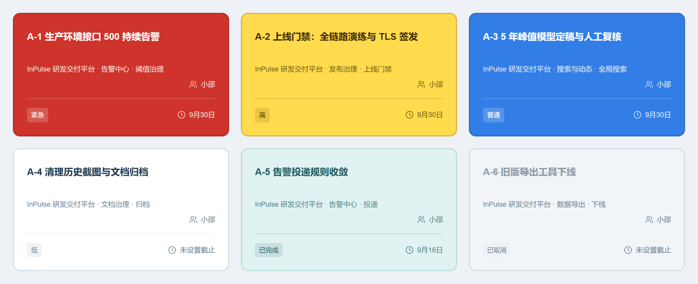
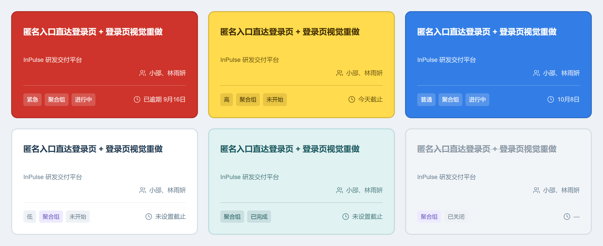
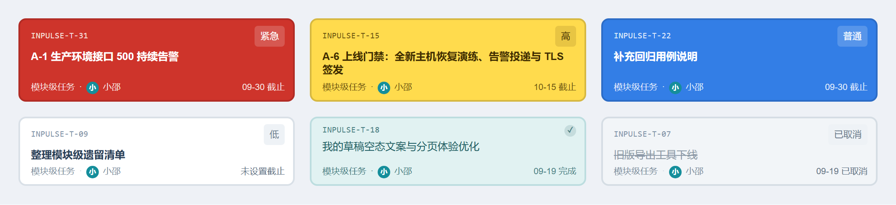

# 任务卡片配色规范

> 状态：阶段 0 实施中。本文件描述前端任务卡片的视觉取值，只记录已落库的实现事实，不改变接口、契约、数据库与权限矩阵。改色值时必须同步更新本文件、[测试矩阵](./test-matrix.md) 的《任务卡片实色配色》章节与 [开发日志](../开发日志.md)。

产品反馈「任务卡片不够醒目」后，卡片从浅色底改为按优先级铺实色（D2 方案）；「高」的底色经两轮候选对比后定为明黄 `#ffdb4d` + 深棕字。以下色值取自 `apps/web/src/styles/design-system.css` 末尾的「任务卡片醒目配色」块，选择器为 `:is(.calm-task-card, .tb-card).tone-prio-*`，比列表行用的 `.tone-prio-*` 高一级，因此只作用于卡片。「已完成」在 2026-09-22 末轮收成一套青碧色值（三处表面同值），见下文《「已完成」：青碧一套色值》。2026-09-22 三次定案后，已逾期与马上到期**不再整卡换色**（产品要求「逾期的不搞特殊了，原本的优先级是什么就呈现什么颜色，只是排序靠前，比紧急低一档」）：卡片只剩「紧急 / 高 / 普通 / 低 / 已完成 / 已取消」六档 + 遗留问题锈红，见下文《逾期与马上到期：不再整卡换色》。由遗留项转换而来的任务另有一档自己的色：整卡锈红 `#8a2b06`，见下文《「遗留问题」：整卡锈红》。

## 六种程度的卡片取值

| 程度 | tone 类名 | 卡片底色 | 描边 | 悬停底色 | 卡内文字 | 文字对比度 |
| --- | --- | --- | --- | --- | --- | --- |
| 紧急 | `tone-prio-urgent` | `#ce342b` | `#b12c25` | `#b92e27` | `#ffffff` | 5.09:1 |
| 高 | `tone-prio-high` | `#ffdb4d` | `#d6b841` | `#edcc48` | `#3f2d00` | 9.8:1 |
| 普通 | `tone-prio-normal` | `#337ee6` | `#2c6cc6` | `#3076d8` | `#ffffff` | 3.99:1 |
| 低 | `tone-prio-low` | `#ffffff` | `#d9e0e7` | `#f5f8fa` | 继承深色正文 | 常规 |
| 已完成 | `tone-prio-done` | `#e1f2f2` | `#bcdddf` | `#d6edee` | `#1d5b62` | 6.67:1 |
| 已取消 | `tone-prio-canceled` | `#f2f5f8` | `#d5dde4` | `#e8edf1` | 继承深色正文 | 常规 |

说明：

- 对比度为白字或深棕字对实色底的计算值。2026-09-22 定色口径（「红色取中 / 全色统一 / 全色样板」三轮样板上拍板）后，**实色卡里仍有落在 4.0:1 上下、低于 AA 的 4.5:1 的**（紧急按红档取中改色后升到 5.09:1；普通仍是 3.99:1）：16px 标题没问题，11–12px 的小字（归属、徽章、到期文案）严格说未达标，产品已知悉并选择先定观感；浅底族的「高」9.76:1、「已完成」6.67:1 不受影响。「高」原本用土黄 `#c47b00` + 白字只有 3.4:1，换成明黄 + 深棕字后达到 9.8:1；「已完成」原本用 `#2f9a68` + 白字只有 3.5:1、换成 `#12875f` 又偏沉，最终定为极浅嫩绿 `#a8e6b0` + 深绿字 `#2f4031`（7.7:1），2026-09-22 逐轮放淡（`#a8e6b0` → `#cdf1d3`）；末轮按聚合组配色候选样板上拍板的 D「青碧」改成青碧底 `#e1f2f2` + 深青字 `#1d5b62`（6.67:1），三处表面不再分色，见下文《「已完成」：青碧一套色值》。
- 「低」用白底、「已取消」用浅灰底，都不铺优先级实色，避免低优先级抢占注意力；白底卡靠 2px 描边与页面底色区分。
- 卡片统一 2px 描边，且不再显示左侧色条（`::before { display: none }`）——底色本身已表达优先级，多一条深色竖边在实色卡上显脏。2026-09-22 起**实色卡的描边统一取「底色压暗 14%」**（紧急 `#ce342b`/`#b12c25`、普通 `#337ee6`/`#2c6cc6`，「遗留问题」锈红 `#8a2b06`/`#772505` 同口径），边/底对比度稳定在 1.29–1.30；浅底族与中性族（高 `#ffdb4d`/`#d6b841`、已完成 `#e1f2f2`/`#bcdddf`、低 `#ffffff`/`#d9e0e7`、已取消 `#f2f5f8`/`#d5dde4`）各自成对，其中已完成的 `#e1f2f2`/`#bcdddf` 是产品 2026-09-22 在聚合组配色候选样板上选定的 D「青碧」。
- 完成态覆盖优先级：「已完成」一律转青碧、「已取消」一律转灰，即 `taskToneOf` 先判 `workStatus` 再判优先级。「已完成」只在「已完成」视图内出现，青碧只表达完成语义、不参与优先级辨识，因此取最浅最亮的一档。

## 「已完成」：青碧一套色值

2026-09-22 产品在聚合组配色候选样板上拍板 D「青碧」（`#e1f2f2` / `#bcdddf`），产品原话「这个改成这个颜色 **D** 青碧 #e1f2f2 / #bcdddf」。同日作废上一版「任务中心 `#cdf1d3`、任务看板另用更浅一档 `#eef8f3`」的分色：任务中心 `/tasks`、项目任务面板与任务看板的卡片、列表行、看板表格行收成同一套值。

| 表面 | 选择器 | 卡片底色 | 描边 | 悬停底色 | 卡内文字 | 文字对比度 |
| --- | --- | --- | --- | --- | --- | --- |
| 任务中心 `/tasks`、项目任务面板、任务看板 | `:is(.calm-task-card, .tb-card).tone-prio-done` | `#e1f2f2` | `#bcdddf` | `#d6edee` | `#1d5b62` | 6.67:1 |

- 只剩这一个选择器：原 `.tb-card.tone-prio-done` 覆盖块已删除，看板不再维护第二套值。
- 深青字 `#1d5b62` 与它的透明变体（soft / faint / divider / badge / icon / check / edge）都写在同一个色值块里，换底色时只改这一处。
- 描边 `#bcdddf` 比底色 `#e1f2f2` 深一档（对底色对比度 1.25:1），与其余卡「描边比底色深一档」同口径。
- 列表行 / 表格行与看板表格行同步：`.tone-prio-done` 的 `--task-c` / `--task-bg` / `--task-hov` / `--task-bd` / `--task-fg` 与 `.tb-row--done` 的 `--tb-row-*` 都取 `#1d5b62` / `#e1f2f2` / `#d6edee` / `#bcdddf`。
- 「已完成」的排序同日改为按完成时间倒序（越晚完成越靠前），见《实现位置》的服务端排序键一条。

## 卡内其余元素的取色

白字组（紧急 / 普通 / 遗留问题）与深字组（高 / 已完成）除正文外还统一处理编号、meta、徽章、日期与勾选；深字组的颜色统一由 `--task-ink-*` 变量驱动，两张浅底卡只在各自色值块里给变量赋值：

| 元素 | 白字组（紧急 / 普通 / 遗留问题） | 深字组（高 / 已完成） |
| --- | --- | --- |
| 标题 | `#ffffff` | `--task-ink`（高 `#3f2d00`、已完成 `#1d5b62`） |
| 正文 / meta / 日期 | `#ffffffd9` | `--task-ink-soft`（同色 80%） |
| 底部行的分隔线 | `#ffffff3d` | `--task-ink-divider`（同色 20%） |
| 普通徽章底 | `#ffffff2e` | `--task-ink-badge`（同色 12%） |
| 优先级徽章 | 与同排标签同款：半透明白底 + 白字 | 与同排标签同款：`--task-ink-badge` + `--task-ink` |
| 遗留问题徽章 | 固定深锈红 `#8a2b06` + 白字（8.6:1），不受卡内统一反白影响 | 同左 |
| 悬停描边 | `#ffffff66` | `--task-ink-edge`（同色 40%） |
| 逾期 / 马上到期日期 | 2026-09-22 三次定案后不再改底色：整卡按任务自己的优先级取色，右下角截止文案（「已逾期 9月16日」/「今天截止」）跟随卡内统一取色 | 同左（浅底卡上就是深字取色） |

## 卡片纵向排版

卡片自上而下的行序（任务中心 `/tasks` 与项目任务面板同款，2026-09-22 定案）：

| 行 | 内容 | 对齐 |
| --- | --- | --- |
| 标题 | 任务标题 | 左；`h3` 是卡片首行，上边距 `4px`（内边距 `22px` + 描边 `2px`，实测距卡片顶 `28px`） |
| 归属 | 任务中心卡片显示「项目 · 模块 · 功能」，项目任务面板卡片显示任务介绍 | 左 |
| 负责人 | 负责人图标 + 姓名 | 右，紧贴分隔线上方（下边距 `15px`） |
| 分隔线 | `.calm-card-bottom` 的 `border-top` | 整行 |
| 底部行 | 左：标签组（优先级 / 模块级 / 主任务 / 来源任务 / 遗留问题 / 已办结），右：截止时间 | 左右分列 |
| 页脚 | 迭代记录数（任务中心）或「更新 + 记录 N 条」（项目任务面板）；没有内容时整块不渲染 | 左 |

- 任务编号与「未完成」徽章都不上卡片：编号只在列表视图的标题下方保留，「未完成」是缺省状态、写在每张卡上只是噪声；已完成 / 已取消仍显示状态徽章。
- 卡片顶部那一行（`.calm-card-top`）整行删除后 `h3` 成了首行，原来的 `20px` 上边距会和外层 `22px` 内边距叠成空档，因此 `.calm-task-card > h3:first-child` 收到 `4px`：实测标题上方空档 `44px → 28px`、卡片高度 `227px → 211px`。
- 标签组从右上角下移到左下角后不再需要 `margin-left: auto`；`.calm-card-bottom > .task-card-badges` 用 `justify-content: flex-start` 从左侧排起，模块 / 功能卡片那种整行右对齐的标签行不受影响。
- 负责人不再和截止时间挤在同一排：`.calm-card-assignee` 单独一行右对齐，与右下角的截止时间分居分隔线两侧。
- 卡内取色的白字组 / 深字组列表都已包含 `.calm-card-assignee`；`.task-id` / `.tb-code` 的编号取色规则仍保留给模块 / 功能卡片与看板卡片行。
- 聚合组卡片（`.task-group-card`）自 2026-09-22 起与任务卡逐行同构：标题 → 归属（项目名）→ 负责人（右对齐贴分隔线）→ 底部行左＝标签组（优先级 + 聚合组 + 状态徽章）、右＝截止（未完成分支中最早的一条）；组卡没有顶部独立行、没有页脚，也没有「查看详情 / 解除合并」提示（整卡即弹窗入口）。顶部「编号 + 徽章」行与卡上的编号（`TG-*`）一并删除，编号只留在列表视图的标题下方与聚合组弹窗里；分支完成计数由状态徽章（未开始 / 进行中 / 已完成）承载，见下文《聚合组卡片：跟随未完成分支的最高优先级》。

## 宽屏网格列数

任务中心 `/tasks` 的卡片网格（`.calm-task-grid`）随窗口宽度换列。2026-09-22 产品要求「窗口拉到最大时一行四张」，实测口径：

| 视口宽度 | 列数 | 卡片宽度（实测） |
| --- | --- | --- |
| ≥ 1440px | 4 | `272px`（1440px）→ `326px`（1680px 起封顶） |
| 1101px ~ 1439px | 3 | `312px`（1280px）→ `365px`（1439px） |
| 701px ~ 1100px | 2 | 沿用既有规则 |
| ≤ 700px | 1 | 沿用既有规则 |

- 四列就是宽屏上限：`.page-content` 最大 `1420px` 加上 `236px` 侧栏，网格容器最宽 `1352px`，窗口再宽也挤不出第五列。
- 四列时 `gap` 由 `20px` 收到 `16px`，避免卡片收窄后正文被挤得过窄。
- 只覆盖任务中心：项目任务面板的卡片网格、模块与功能列表仍是三列，功能档案与功能弹窗里的 `.calm-task-grid` 仍是两列。

## 聚合组卡片：跟随未完成分支的最高优先级 + 未开始 / 进行中 / 已完成

任务聚合组卡片与任务卡片同网格混排（2026-09-21 定案）。2026-09-22 产品要求「组合任务取消紫色，按合并任务以内部未完成任务中的最高优先级显示颜色」：组卡不再按「组状态」取靛蓝 / 紫 / 青碧，整卡底色与任务卡片共用同一套 `.tone-prio-*`。

| 组状态 | tone 类名 | 卡片底色 | 描边 | 悬停底色 | 卡内文字 |
| --- | --- | --- | --- | --- | --- |
| 未开始 / 进行中，未完成分支最高一档 = 紧急 | `tone-prio-urgent` | `#ce342b` | `#b12c25` | `#b92e27` | `#ffffff`（5.09:1） |
| 未开始 / 进行中，最高一档 = 高 | `tone-prio-high` | `#ffdb4d` | `#d6b841` | `#edcc48` | `#3f2d00`（9.76:1） |
| 未开始 / 进行中，最高一档 = 普通 | `tone-prio-normal` | `#337ee6` | `#2c6cc6` | `#3076d8` | `#ffffff`（3.99:1） |
| 未开始 / 进行中，最高一档 = 低 | `tone-prio-low` | `#ffffff` | `#d9e0e7` | `#f5f8fa` | 深色正文 |
| 已完成（分支全部收尾） | `tone-prio-done` | `#e1f2f2` | `#bcdddf` | `#d6edee` | `#1d5b62`（6.67:1） |
| 已关闭且无分支（无事实可派生） | `tone-prio-canceled` | `#f2f5f8` | `#d5dde4` | `#e8edf1` | 深色正文 |

说明：

- 只派生一个事实：`describeTaskGroup` 取未完成（`workStatus === "TODO"`）分支里最高的一档（紧急 > 高 > 普通 > 低）；该分支完成后自动落到第二高，全部分支收尾后按「已完成」呈现并隐藏优先级徽章。已取消与已完成一样算收尾，否则被取消的分支会永远压住组优先级。
- 状态徽章三态（2026-09-22 产品口径「没有任何任务完成就显示未开始，有任意任务完成了就是进行中，所有任务都完成了就归到已完成那边」）：组内 `doneCount === 0` →「未开始」（`gray`）、`0 < doneCount < 分支数` →「进行中」（`blue`）、`completed` →「已完成」（`green`）；已关闭且没有分支的组保留「已关闭」（没有事实可派生，不参与三态）。徽章的 `title` 仍给出「n / N 条分支任务已完成」的明细计数。
- 归属跟随工具栏「未完成 / 已完成」（同一产品口径的「归到已完成那边」）：R-7 不接受 `status` 参数，因此 `visibleGroups` 在渲染前用 `isTaskGroupCompleted`（与徽章同一个判据：有分支且没有 `TODO` 分支）把组分成两档——全部分支收尾的组只出现在「已完成」档，`status=all` 时两档都展示。
- 组卡与组行都走 `@features/common/task-tone` 的 `taskToneClassName`，与任务卡片同一份色值：卡片吃实色块（`:is(.calm-task-card, .tb-card).tone-prio-*`），列表视图的组行只吃 `.tone-prio-*` 的浅色变量（左侧 3px 色条 + 浅色底），与任务行同口径。
- 未完成组的排序（2026-09-22 产品要求「当组合任务为未完成状态（未开始或进行中）排序按照合并任务以内部未完成任务中的最高优先级」，同日追加「（它们）同样是一个优先级的，按照截止日期从近到远排序」）：组卡不再单独排一遍再追加到任务卡后面，而是与任务卡共用 `gridEntries` 这一把尺子——状态分组（未完成 0 / 已完成 1 / 已取消 2）→ 紧急桶（遗留问题来源 0 / 标记紧急 1 / 已逾期 2 / 今-明日截止 3 / 其余 4）→ 优先级档位（组取未完成分支最高一档）→ 截止时间近到远（组取未完成分支中最早的一条，未设截止排最后）。前三项都取自服务端 `apps/api/src/modules/tasks/task-list-order.ts` 的排序键，组卡的三项都从「未完成分支」派生；卡片视图与列表视图同一顺序，同键保持稳定次序（任务在前、组保持 R-7 顺序）。`visibleGroups` 现在只做「未完成 / 已完成」归属筛选。
- 组卡不参与日期档（2026-09-22 三次定案「逾期的不搞特殊了，原本的优先级是什么就呈现什么颜色」）：`describeTaskGroup` 的 `tone` 只由派生优先级决定，右下角的截止文案仍按未完成分支中最早的一条显示（与任务卡片同文案，如「已逾期 9月16日」），不会把整卡染红。同日早些时候先落的「组卡底走截止档（未完成分支最早一条已逾期 → `tone-prio-overdue`、今天到期 → `tone-prio-soon`）」按本条口径作废，本地真实数据 `K123-TG-1`（两条分支都未完成、最早截止已逾期）因此回到派生优先级的普通蓝。
- 卡内文字不再为组卡单写一套：组卡本身带 `.calm-task-card`，白字组（紧急 / 普通 / 遗留问题）与深字组（高 / 已完成）的既有规则直接命中底部那一排的徽章与截止文案，因此不需要额外的组卡规则。
- 2026-09-22 同日先落的「按组状态定色」三支组专用色（`.tone-group-open` 实色靛蓝 `#5b6fd6`、`.tone-group-done` 青碧 `#e1f2f2`、`.tone-group` 实色紫 `#7c6bd0`）连同配套的整卡反白一并删除；「已关闭且无分支」的兜底由中性灰 `tone-prio-canceled` 承担，聚合组不再有固定身份色。卡片右上角的「聚合组」徽章仍是 violet 标签色（它只是标签，不代表整卡底色）。
- 卡片排版（2026-09-22 产品要求「这个卡片的布局要和 P2 一样」，随后追加「把左下角已完成放到右上角、取消提示文案，直接点卡片就能看详情」，同日再追加「组合任务的排版和单个任务排版对齐统一」）：顶部「编号 + 徽章」行删除；标题、归属、负责人（右对齐贴分隔线）、底部行左＝标签组（优先级 + 聚合组 + 状态）、右＝截止（`.calm-card-bottom > span:last-child`，取未完成分支中最早的一条，与任务卡片同款时钟图标 + 文案，`white-space: nowrap` + `flex-shrink: 0` 保证不折行）。上一版单占右上角一行的分支完成计数（`.task-group-card-top` + `.task-card-counts`）连同 `+ h3 { margin-top: 12px }` 一并删除，计数改由状态徽章承载；底部那一排只留三枚徽章，分支数收进「聚合组」徽章的 `title`（272px 卡片里第四枚标签会折到第三行、把这一排从 41px 顶到 71px）。原来的页脚与「查看详情 / 解除合并」提示整块删除——整卡本身就是弹窗入口，那行只是重复说明。编号（`TG-*`）只留在列表视图的标题下方与聚合组弹窗里，与任务卡的编号口径一致。实测 `/tasks` 的 `K123-TG-1` 与相邻任务卡：两张卡都是 `H3 → P.task-belonging → DIV.calm-card-assignee → DIV.calm-card-bottom` 四行、卡片高度同为 241px。
- 组卡与任务卡片在日期档上完全同源（2026-09-22 三次定案后都不再有日期档）：已逾期与今天到期只体现在排序（服务端紧急桶把已逾期排在「标记紧急」之后一档）与截止列 / 看板日期的文字色上，「整卡转红」的口径已作废；组卡底色的红只可能来自「未完成分支最高优先级 = 紧急」。
- 已知取舍：与任务卡片同源——紧急 / 普通两支实色卡的白字对比度 5.09:1 / 3.99:1（普通仍略低于 AA 的 4.5:1）（16px 标题没问题，11–12px 小字严格说未达标），组卡与任务卡现在完全一致。
- 事实来源是 R-7 列表分支（`GET /api/v1/task-groups` 的 `branches[].workStatus` 与 `priority`）：服务端不下发 `priority` 时，前端 `completed` 会被算成 true，进行中的组卡静默降级成「已完成」浅绿并隐藏优先级徽章。2026-09-22 本地 `apps/api` 与 `packages/api-contract` 的 `dist` 停留在旧构建（分支里没有 `priority` / `moduleName` / `featureName` / `dueAt` / `publishedRecordCount`），组卡因此一直呈已完成态；重建两个 dist 后恢复。该依赖的回归由 CARD-COLOR-API-001 覆盖。

## 逾期与马上到期：不再整卡换色

产品 2026-09-22 先反馈「紧急、已逾期、马上到期最好都呈现红色」，落成「三档整卡铺红 + 白字」；同日三次定案又明确「`#CE342B` 紧急用这个颜色，然后逾期的不搞特殊了，原本的优先级是什么就呈现什么颜色，只是排序靠前，比紧急低一档」。**当前实现只剩一支红**：

| 档位 | 触发条件 | tone 类名 | 卡片底色 | 描边 | 悬停底色 | 白字对比度 |
| --- | --- | --- | --- | --- | --- | --- |
| 紧急（优先级） | `priority = URGENT` | `tone-prio-urgent` | `#ce342b` | `#b12c25` | `#b92e27` | 5.09:1 |

已逾期与马上到期因此**不再有 tone 档**：`TaskToneName` 里的 `overdue` / `soon`、`.tone-prio-overdue` / `.tone-prio-soon` 两块实色、白字组里的两个选择器、旧版三档整卡红的样图都已删除。逾期只剩两处与卡片底色无关的体现：

- 排序：服务端 `apps/api/src/modules/tasks/task-list-order.ts` 的紧急桶（仅未完成参与，命中第一个）把未完成任务排成「遗留问题来源(0) → 标记紧急(1) → 已逾期(2) → 今/明日截止(3) → 其余(4)」——已逾期落在「标记紧急」之后一档，仍排在普通任务之前。游标键版本随之由 1 升到 2，旧游标按无效游标拒绝。
- 日期文案：卡片右下角仍是「已逾期 9月16日」/「今天截止」（`dueLabelOf`），跟随卡内统一取色；白底表面的截止列与看板日期继续用文字色提示，见本节末段。

判档口径（现在只驱动文案与排序，不再驱动卡片 tone）：

- 完成态永远不参与：「已完成」走 `tone-prio-done`、「已取消」走 `tone-prio-canceled`。
- 卡片一律按任务自己的优先级取色：「高」逾期仍是高明黄、「普通」逾期仍是普通蓝；「遗留问题」来源仍是锈红（见下文《「遗留问题」：整卡锈红》）。
- 任务中心与项目任务面板按 `dueAt` 与当地日历日比较（已过期 / 今天到期）；任务看板只读服务端 `dueState`（OVERDUE / TODAY），不在前端按本地时钟重算；「明天到期」与更远的日期都不进档。

红档取中的取值：紧急由 `#e84138` 改为 `#ce342b`（sRGB 中点与 Oklab 中点同值 `#ce342b` / `#cd342b`，按 sRGB 取 `#ce342b`），描边 `#b12c25`（压暗 14%）、悬停 `#b92e27`（压暗 10%）；白字对比度由 4.00:1 升到 5.09:1。优先级下拉圆点与该值同源，见下文《优先级圆点》。

白底表面（列表 / 表格的截止列、详情弹窗徽章）不铺底色、只改文字色并加粗：任务中心表格与项目任务面板列表的 `td.due-overdue` / `td.due-soon`、任务详情弹窗徽章 `.calm-due.due-red`（`#b3261e`）与 `.calm-due.due-amber`（`#c9472c`）、看板日期 `.tb-date--overdue` / `.tb-date--today`。表格行本身是浅色底，铺整卡色会压掉正文可读性。

## 「遗留问题」：整卡锈红

产品 2026-09-22 反馈「遗留问题整个卡片都要是红色的」：由遗留项转换而来的任务（`hasLeftoverSource`，R-5 批量标记）不再只挂一枚深锈红徽章，整张卡片铺锈红 + 白字。

| 档位 | tone 类名 | 卡片底色 | 描边 | 悬停底色 | 白字对比度 | 列表行底色 | 列表行文字 |
| --- | --- | --- | --- | --- | --- | --- | --- |
| 遗留问题 | `tone-prio-leftover` | `#8a2b06` | `#772505` | `#7c2705` | 8.65:1 | `#fbeee9` | `#8a2b06` |

说明：

- 色值与「遗留问题」徽章（`.badge-leftover`）同源：卡片底色、列表行色条与文字、徽章实底都是 `#8a2b06`；描边按既定口径取「底色压暗 14%」（`#772505`），悬停取压暗 10%（`#7c2705`）。白字对比度 8.65:1，高于其余实色卡（紧急 5.09:1、普通 3.99:1），因此卡内 11–12px 的小字在这一档上反而不存在 AA 取舍。
- 覆盖次序（`task-tone.ts` 的 `taskToneOf(priority, workStatus, hasLeftoverSource)`，2026-09-22 三次定案后只剩三个参数）：已完成 → 已取消 → 紧急 → **遗留问题** → 优先级。完成态与最高优先级身份都不被来源标记盖掉——遗留项转来的紧急卡仍是紧急红 `#ce342b`；只有「高 / 普通 / 低」三档会被来源标记接管成锈红。因此遗留项的卡片恒为红系两档之一（紧急红或锈红），不会再出现蓝卡或黄卡；这张卡是不是遗留项由卡上的「遗留问题」徽章与卡片底色共同表达。
- 徽章不重复强调来源：卡片本身已是锈红时，「遗留问题」徽章与卡内其余徽章一样走半透明白底（`:is(.calm-task-card, .tb-card).tone-prio-leftover .badge-leftover`）——来源标记由整卡底色承担；其余实色卡上该徽章仍是深锈红实底 + 白字。
- 列表行与表格行按既有口径只吃浅色变量：项目任务面板列表（`.feature-list-table tbody tr`）与任务中心表格（同一套 `.tone-prio-*`）都是浅锈红底 `#fbeee9` + 锈红文字 `#8a2b06`；任务看板列表视图另有与 `tb-row--tone-*` / `tb-row--done` / `tb-row--canceled` 并列的 `.tb-row--leftover`（色条与文字 `#8a2b06`、底色 `#fbeee9`、悬停 `#f7e3da`）。
- 实测（无头 Chromium 1440 宽，本地 dev 5173，真实数据只读）：任务中心的 `A-5 残余：5 年峰值模型定稿与 1.2 倍条件人工复核`（`hasLeftoverSource`、普通、未逾期）得 `calm-task-card tone-prio-leftover`、背景 `rgb(138, 43, 6)`、描边 `rgb(119, 37, 5)`、文字 `rgb(255, 255, 255)`，卡内两枚徽章（普通 / 遗留问题）都是 `rgba(255, 255, 255, 0.18)` 底 + 白字；同页相邻的 `A-6` 仍是高明黄 `rgb(255, 219, 77)`、普通任务仍是普通蓝 `rgb(51, 126, 230)`、逾期组卡仍是 `rgb(179, 38, 30)`。切「列表」视图后该行类名为 `tone-prio-leftover`、底色 `rgb(251, 238, 233)`、标题 `rgb(138, 43, 6)`。

## 任务看板卡片

任务看板（`/projects/:id/task-board`）的 `.tb-card` 与任务中心的 `.calm-task-card` 共用同一组实色，区别只在卡内元素更紧凑。2026-09-22 起「已完成」在任务中心、项目任务面板与任务看板统一走 D 青碧（`#e1f2f2` / `#bcdddf`），不再按表面分色：

## 列表行与表格行保持浅色

项目任务面板列表（`.feature-list-table tbody tr`）与看板列表视图（`.tb-row--tone-*`）继续用 `.tone-prio-*` 的浅色底与左侧色条：表格里深底配深字读不出来，因此不做实色。同一程度在卡片与列表行的色值不同，属于刻意选择。看板列表视图的「遗留问题」行单独用 `.tb-row--leftover`（`--tb-row-accent` / `--tb-row-fg` `#8a2b06`、`--tb-row-bg` `#fbeee9`、`--tb-row-hover` `#f7e3da`），与其他行配色块并列。

| 程度 | 色条 | 底色 | 悬停底色 | 描边 | 文字 |
| --- | --- | --- | --- | --- | --- |
| 紧急 | `#c0453f` | `#fdf2f1` | `#fbe7e5` | `#f2d3d0` | `#8f3f3f` |
| 高 | `#c9821a` | `#fdf8ee` | `#faeed7` | `#f0dfc0` | `#7d5310` |
| 普通 | `#1467d8` | `#f0f5fd` | `#e1ecfa` | `#cfdff7` | `#16528f` |
| 低 | `#a0adb9` | `#f6f8fa` | `#ebeff3` | `#dfe5ea` | `#5f6d7a` |
| 已完成 | `#1d5b62` | `#e1f2f2` | `#d6edee` | `#bcdddf` | `#1d5b62` |
| 已取消 | `#aab7c4` | `#f5f7f9` | `#ebeff3` | `#e3e8ed` | `#75828f` |
| 遗留问题 | `#8a2b06` | `#fbeee9` | `#f7e3da` | `#f0d5c9` | `#8a2b06` |

## 优先级圆点

新建 / 编辑任务与遗留问题转换等处的优先级下拉圆点取与卡片同源的色值（`apps/web/src/features/common/priority-select-option.ts`）。「高」的明黄圆点压在白底弹层里看不见，因此圆点取同色的深版 `#8a6e00`：

| 优先级 | 卡片实色 | 下拉圆点 |
| --- | --- | --- |
| URGENT | `#ce342b` | `#ce342b` |
| HIGH | `#ffdb4d` | `#8a6e00` |
| NORMAL | `#337ee6` | `#337ee6` |
| LOW | 不铺实色 | `#a0adb9` |

## 实现位置

- `apps/web/src/styles/design-system.css`「任务卡片醒目配色」块：卡片实色、描边、悬停与卡内文字（实色红只剩紧急一支）；同文件上方的 `.tone-prio-*` 仍供列表行使用；末尾「红档收敛成一支」说明块记录口径与对比度。
- `apps/web/src/features/common/task-tone.ts`：优先级 / 完成状态 / 遗留问题来源到 tone 类名的映射（`taskToneOf(priority, workStatus, hasLeftoverSource)`，`TaskToneName` 含 `leftover`；覆盖次序为完成态 → 已取消 → 紧急 → 遗留问题 → 优先级）。`TaskDueTone` 类型保留，但只描述「截止有多紧」，不再进入卡片 tone。
- `apps/web/src/features/common/task-tone.test.ts`：覆盖次序、完成态最优先与「不再产出 `tone-prio-overdue` / `tone-prio-soon`」的映射单测。
- `apps/web/src/features/common/priority-select-option.ts`：优先级下拉圆点色，与卡片实色同源，色值分两处维护。
- `apps/web/src/features/common/priority-select-option.test.ts`：圆点取值单测。
- `apps/web/src/features/my-tasks/TaskCenterPageView.tsx`：`dueToneOf` 判档（与 `dueLabelOf` 一起只驱动文案）与 `dueToneClass`（列表截止列的文字色）；卡片把标签组（优先级 + 其余标签）渲染在分隔线以下的底部行左侧，负责人渲染在分隔线上方的 `.calm-card-assignee`。
- `apps/web/src/features/tasks/TasksPanel.tsx`：`dueInfo`（详情弹窗徽章与截止列的文案 / 文字色）；表格与卡片都只吃 `taskToneClassName` 的优先级结果，日期不再参与卡片取色。
- `apps/web/src/features/my-tasks/TaskCenterPageView.tsx` 与 `apps/web/src/features/tasks/TasksPanel.tsx` 的卡片：编号与「未完成」徽章已移除、`.calm-card-top` 整行不再渲染；标签组落到 `.calm-card-bottom` 的左侧，负责人拆成独立的 `.calm-card-assignee` 贴在分隔线上方并右对齐（样式见 `design-system.css` 的 `.calm-card-assignee` 与 `.calm-card-bottom > .task-card-badges`）。
- `apps/web/src/styles/design-system.css` 的 `@media (min-width: 1440px)` 块：只对 `.task-center .calm-task-grid` 把列数改成四列、`gap` 收到 `16px`；项目任务面板与模块 / 功能列表、功能档案与功能弹窗的卡片网格列数不变。
- `apps/web/src/styles/design-system.css` 的聚合组配色与排版：组卡与组行都只吃上面的 `.tone-prio-*`；组专用色块（`.tone-group` / `.tone-group-open` / `.tone-group-done` 与配套的 `.calm-task-card.task-group-card.*` 实色反白）已于 2026-09-22 删除。右上角计数行 `.task-group-card-top` 与配套的 `+ h3 { margin-top: 12px }` 也在同日第三次调整中删除，`.task-group-card-open` 与它的兜底色规则随提示一起删除；组卡底部那一排复用任务卡片的 `.calm-card-bottom` / `.task-card-badges`，新增的只有一条 `.calm-task-card .calm-card-bottom > span:last-child { white-space: nowrap; flex-shrink: 0 }`（保证右下角的截止文案不折行）。`.task-card-counts` 本身保留给任务卡片的记录计数页脚。
- `apps/web/src/features/my-tasks/TaskCenterPageView.tsx` 的 `describeTaskGroup`：派生 `tone` 统一走 `taskToneClassName`（有未完成分支 → 最高一档的 `tone-prio-*`、分支全部收尾 → `tone-prio-done`、无分支 → `tone-prio-canceled`），并派生状态徽章的 `stateLabel` / `stateTone` / `stateTitle`（未开始 / 进行中 / 已完成，已关闭保留给无分支的组）；卡片、组行与工具栏归属共用该结果，组归属判据 `isTaskGroupCompleted` 是文件级函数，避免多处判定漂移。
- `apps/web/src/features/task-board/components/TaskBoardLanes.tsx`：看板卡片只按优先级 / 完成态 / 遗留来源取色；逾期与今天到期只在日期文案上用 `.tb-date--overdue` / `.tb-date--today` 提示（读取服务端 `dueState`，不在前端重算）。
- `apps/api/src/modules/tasks/task-list-order.ts`：统一排序键的紧急桶 / 完成时间倒序与游标键版本（`TASK_LIST_SORT_KEY_VERSION`，2026-09-22 由 1 升到 2，同日再升到 3：新增「完成时间倒序」一级，已完成分组按 `completed_at` 从晚到早，未完成 / 已取消用 `'-infinity'` 归一后不参与比较；游标载荷由 6 段变 7 段）。
- `apps/web/src/features/task-board/components/TaskBoardLanes.tsx` 的 `cardClassNameOf(card, leftoverSource)` 与 `apps/web/src/features/task-board/components/TaskBoardTable.tsx` 的 `rowClassNameOf(card, leftoverSource)`：看板卡片与看板列表行都把 R-5 的 `hasLeftoverSource` 传给 `taskToneClassName` 的第 4 个参数（看板列表行另追加 `tb-row--leftover`）。
- `apps/web/src/features/my-tasks/TaskCenterPageView.tsx`（卡片与表格行）与 `apps/web/src/features/tasks/TasksPanel.tsx`（卡片与表格行）：四个调用点同样把 `hasLeftoverSource` / `leftoverSource` 传进 `taskToneClassName`，与列表行的浅色变量配套。
- `apps/web/src/styles/design-system.css` 的 `.tone-prio-leftover` 浅色变量块（列表行 / 表格行）与 `:is(.calm-task-card, .tb-card).tone-prio-leftover` 实色块（卡片），以及白字组选择器列表里新增的 `.tone-prio-leftover`；`.tb-row--leftover` 声明在 `.tb-row--canceled` 之后。

## 变更历史

| 日期 | 变更 |
| --- | --- |
| 2026-09-21 | 任务卡片按优先级改铺实色（D2）：紧急 / 普通 / 已完成白字，低 / 已取消浅灰底；「高」初用土黄 `#c47b00` + 白字。 |
| 2026-09-21 | 「高」改为明黄 + 深棕字，卡片左侧色条整体移除。 |
| 2026-09-21 | 末轮黄色候选对比后，「高」定稿为 `#ffdb4d`，描边 `#d6b841`、悬停 `#edcc48`，下拉圆点 `#8a6e00`。 |
| 2026-09-22 | 「低」底色由 `#eef2f6` 改为纯白 `#ffffff`，描边 `#d9e0e7`、悬停 `#f5f8fa`。 |
| 2026-09-22 | 「已完成」由 `#2f9a68` 换成翡翠绿 `#12875f`（描边 `#0f6f4e`、悬停 `#117c57`），白字对比度由 3.5:1 提到 4.5:1。 |
| 2026-09-22 | 新增「红色三档」第一版：已逾期改实心深红签 `#b3261e` + 白字、马上到期改浅红签 `#fde3de` + `#a8281c`（蓝底 / 红底卡改用白签承载同样的红）。白底表面（表格行、详情弹窗徽章）只用文字色 `#b3261e` / `#c9472c`；项目任务面板表格原先对每一行都写死 `due-overdue`，改为按 `dueInfo` 判定。该版卡内签当天被下面的「三档整卡红」取代。 |
| 2026-09-22 | 卡片顶部布局调整：编号从卡片移除（列表视图仍保留）、「未完成」不再占徽章位、优先级徽章从页脚搬到右上角标签组；页脚只剩迭代记录，无记录时整块不渲染。 |
| 2026-09-22 | 卡片纵向排版二次调整：标签组从右上角下移到分隔线以下的左下角，负责人拆成独立一行贴分隔线上方并右对齐；`h3` 成为首行后把上边距从 `20px` 收到 `4px`，标题上方空档与卡片高度实测 `44px → 28px`、`227px → 211px`。 |
| 2026-09-22 | 「遗留问题」徽章改为固定深锈红 `#8a2b06` 实底 + 白字（新增 `.badge-leftover` 与 `CalmBadgeTone` 的 leftover 档）：实色卡上的统一反白会把卡内所有 `.badge` 压成同一种半透明白，「遗留问题」这种来源标记就分辨不出来，因此这条规则在两个底色组里都显式还原；任务中心、项目任务面板、任务看板卡片与看板列表行四处同款。 |
| 2026-09-22 | 二次定案「三档整卡红」：已逾期整卡 `#b3261e`、马上到期整卡 `#c2410c`（紧急沿用 `#d63b31`），卡内日期签整体删除；`task-tone.ts` 的 `taskToneOf` 增加截止紧迫度参数（完成态最优先、日期档覆盖优先级档），任务中心 / 项目任务面板 / 任务看板三处卡片共用。 |
| 2026-09-22 | 「已完成」按反馈逐轮放浅（`#12875f` → `#57c98d` → 定稿 `#a8e6b0`），改为浅底卡：底色 `#a8e6b0`、悬停 `#9bd4a2`、深绿字 `#2f4031`（7.7:1）；描边取同色更浅的 `#bfe8c6`，让浅绿底自然浮出、不被绿框框住。 |
| 2026-09-22 | 任务中心卡片网格改宽屏四列：新增 `@media (min-width: 1440px)` 覆盖（`gap` 由 `20px` 收到 `16px`），`1440px` 起一行四张、`1439px` 及以下仍是三列；实测 1280 / 1360 / 1439 为三列（卡片 `312px` / `339px` / `365px`），1440 / 1536 / 1680 / 1920 为四列（卡片 `272px` / `296px` / `326px` / `326px`）。 |
| 2026-09-22 | 「已完成」绿色第四轮放淡：底色 `#a8e6b0` → `#cdf1d3`、悬停 `#9bd4a2` → `#c0ebc7`、描边 `#bfe8c6` → `#ddf4e1`，深绿字 `#2f4031` 不动（对比度 7.7:1 → 9.0:1）；任务中心与项目任务面板卡片、看板卡片同款（同一组 `--task-bg` / `--task-bd` / `--task-hov`）。 |
| 2026-09-22 | 「已完成」绿色第五轮（定稿）：按产品给的截图把卡片底色定为 `#eef8f3`（截图实测值，原本只用在列表行的浅色）、悬停 `#ddf0e5`、描边 `#d4e8dd`，深绿字 `#2f4031` 不动（对比度 9.0:1 → 10.2:1）；任务中心与项目任务面板卡片、看板卡片一度同款，当天下一条记录按产品要求回调为分色。 |
| 2026-09-22 | 任务中心 / 项目任务面板的「已完成」描边由 `#ddf4e1`（比底色 `#cdf1d3` 浅，视觉上等于没有边框）加深为 `#a3d9b0`（对底色对比度 1.31:1，与「紧急」卡同档），看板 `.tb-card` 的 `#d4e8dd` 不变。实测 `/tasks?status=done` 与项目任务面板计算描边均为 `rgb(163, 217, 176)`。 |
| 2026-09-22 | 「已完成」绿色分色（定稿）：任务中心 `/tasks` 与项目任务面板回到 `#cdf1d3`（描边 `#ddf4e1`、悬停 `#c0ebc7`，9.0:1），任务看板单独保留 `#eef8f3`（描边 `#d4e8dd`、悬停 `#ddf0e5`，10.2:1）；`design-system.css` 保留 `:is(.calm-task-card, .tb-card).tone-prio-done` 基础块、其后新增同权重的 `.tb-card.tone-prio-done` 覆盖块，深绿字 `#2f4031` 共用。实测 `/tasks?status=done` 计算底色 `rgb(205, 241, 211)`、描边 `rgb(221, 244, 225)`；`/projects/1/task-board` 计算底色 `rgb(238, 248, 243)`、描边 `rgb(212, 232, 221)`。 |
| 2026-09-22 | 聚合组卡片改为按「组状态」定色（产品在候选样板上逐状态选定）：进行中 `tone-group-open` 实色靛蓝 `#5b6fd6` / `#4c5ebf`、已完成 `tone-group-done` 青碧 `#e1f2f2` / `#bcdddf` + 深青字 `#1d5b62`、已关闭 `tone-group` 实色紫 `#7c6bd0` / `#6a58c0`。组卡底色此前跟随分支的派生优先级（复用 `.tone-prio-*`、兜底浅紫 `#f8f6ff`），优先级改由页脚徽章单独表达；实色只加在 `.calm-task-card.task-group-card` 上，列表组行继续取同一组类名的浅色变量。 |
| 2026-09-22 | 定色口径统一（产品在「红色取中 / 全色统一 / 全色样板」三轮样板上拍板）：实色卡饱和度封顶 78%、感知明度对齐 L\* 53，档位靠色相区分；四张实色卡描边统一取「底色压暗 14%」。据此重定三支 —— 紧急 `#d63b31` → `#e84138`（S67→79、L\*52→56，白字 4.64:1 → 4.00:1）、普通 `#0f6ae8` → `#337ee6`（S88→78、L\*47→53，4.94:1 → 3.99:1）、马上到期 `#c2410c` → `#d9541b`（S88→78、L\*46→53，5.18:1 → 4.01:1）；已逾期底色 `#b3261e` 不动、描边 `#8f1d17` → `#9a211a`。`priority-select-option.ts` 的 URGENT / NORMAL 圆点同步为 `#e84138` / `#337ee6`。副作用：四张实色卡的白字对比度都落到 4.0:1 上下、低于 AA 的 4.5:1，16px 标题没问题、11–12px 小字严格说未达标，产品已知悉并选择先定观感。 |
| 2026-09-22 | 聚合组卡片取消紫色与靛蓝（产品要求「组合任务取消紫色，按合并任务以内部未完成任务中的最高优先级显示颜色」）：组卡与组行底色回到与任务卡片同一套 `.tone-prio-*`（未完成分支最高一档 = 紧急红 / 高明黄 / 普通蓝 / 低白，全部分支收尾 = 完成绿 `#cdf1d3`，已关闭无分支 = 中性灰 `tone-prio-canceled`）；删除同日先落的 `.tone-group-open` 靛蓝 `#5b6fd6` / `.tone-group-done` 青碧 `#e1f2f2` / `.tone-group` 紫 `#7c6bd0` 与配套整卡反白，卡内文字改由白字组 / 深字组既有规则承担。实测本地 `/tasks?status=open` 的 `K123-TG-1` 组卡得 `tone-prio-normal`、底色 `rgb(51, 126, 230)`、标题白字。 |
| 2026-09-22 | 聚合组卡片排版对齐任务卡（产品要求「这个卡片的布局要和 P2 一样」）：删除 `.calm-card-top`（编号 + 徽章）整行，标题成为首行；负责人移到 `.calm-card-assignee` 右对齐贴分隔线；标签组（优先级 + 聚合组 + 状态）改到分隔线以下的左下角；右下角为「N 条分支」；页脚为「已完成 n/N」+「查看详情 / 解除合并」。编号 `TG-*` 与任务卡一致，只留在列表视图与弹窗里。 |
| 2026-09-22 | 组卡再微调（产品要求「把左下角已完成这个放到右上角，取消 [查看详情 / 解除合并] 提示，直接点击卡片就可以查看详情」）：分支完成计数从页脚左下角移到卡片右上角（`.task-group-card-top`），「查看详情 / 解除合并」整块与其 CSS（`.task-group-card-open`）删除，组卡不再渲染页脚；无分支的 CLOSED 组不渲染计数行。实测 `K123-TG-1`：首个元素是 `.task-group-card-top`、计数「已完成 0/2」在 `rgb(51, 126, 230)` 实色卡上取 `rgba(255, 255, 255, 0.85)`、`h3` 上边距 12px、页脚与提示均为 null。 |
| 2026-09-22 | 组卡状态徽章改三态（产品口径「没有任何任务完成就显示未开始，有任意任务完成了就是进行中，所有任务都完成了就归到已完成那边」）：`describeTaskGroup` 新增 `stateLabel`（未开始 `gray` / 进行中 `blue` / 已完成 `green`，无分支的已关闭组保留「已关闭」）与 `stateTitle`（n / N 条分支任务已完成）；组卡与组行的状态列同步，`visibleGroups` 按同一个 `isTaskGroupCompleted` 判据把全部分支收尾的组归到工具栏「已完成」档（`/tasks?status=done` 可见，`status=open` 不再出现）。 |
| 2026-09-22 | 组卡排版与任务卡对齐统一（产品要求「组合任务的排版和单个任务排版对齐统一」）：删除右上角计数行（`.task-group-card-top` 与 `+ h3` 边距规则）与底部「N 条分支」，底部那一排改为与任务卡同构的「三枚徽章（优先级 / 聚合组 / 状态）+ 右下角截止（未完成分支中最早的一条，时钟图标 + 同款文案）」，分支数收进「聚合组」徽章的 `title`；新增 `.calm-task-card .calm-card-bottom > span:last-child { white-space: nowrap; flex-shrink: 0 }`。实测 `/tasks` 组卡与相邻任务卡同为四行结构、高度同为 241px（组卡三枚徽章在 272px 卡片里占两行，底部行 71px，单个任务卡 41px——内容驱动的折行，不是结构差异）。 |
| 2026-09-22 | 聚合组两项补口径：未完成组按「未完成分支最高一档」排序（紧急 → 高 → 普通 → 低，同档保持 R-7 服务端顺序，卡片与列表共用）；组卡底新增日期档（未完成分支最早一条已逾期 → `tone-prio-overdue`、今天到期 → `tone-prio-soon`），与任务卡片同一套色值。此前「含已逾期分支的组卡不整卡转红」的待定口径按产品答复「有逾期就按照逾期的颜色」作废。本地 `K123-TG-1` 由 `tone-prio-normal` 变为 `tone-prio-overdue`、底色 `rgb(179, 38, 30)`。 |
| 2026-09-22 | 新增「遗留问题」整卡锈红（产品要求「遗留问题整个卡片都要是红色的」）：`TaskToneName` 新增 `leftover`，`taskToneOf` / `taskToneClassName` 增加第 4 个参数 `hasLeftoverSource`，覆盖次序为完成态 → 已取消 → 已逾期 → 马上到期 → 紧急 → 遗留问题 → 优先级；卡片实色 `#8a2b06` / 描边 `#772505` / 悬停 `#7c2705` + 白字（8.65:1），列表行与表格行浅锈红 `#fbeee9` + `#8a2b06`，看板列表行新增 `.tb-row--leftover`；卡片本身已是锈红时「遗留问题」徽章改走半透明白底。实测任务中心 A-5 卡得 `tone-prio-leftover`、背景 `rgb(138, 43, 6)`。 |
| 2026-09-22 | 红档收敛成一支（产品要求「`#CE342B` 紧急用这个颜色，然后逾期的不搞特殊了，原本的优先级是什么就呈现什么颜色，只是排序靠前，比紧急低一档」）：紧急由 `#e84138` 改为 `#ce342b`（sRGB 中点与 Oklab 中点同值，取 sRGB 值；描边 `#b12c25`、悬停 `#b92e27`，白字对比度 4.00:1 → 5.09:1），`priority-select-option.ts` 的 URGENT 圆点同步；已逾期 / 马上到期**退出卡片配色**——`TaskToneName` 的 `overdue` / `soon`、`.tone-prio-*` 两块实色、白字组里的两个选择器与旧样图全部删除，`taskToneOf` / `taskToneClassName` 从四个参数回到三个（`hasLeftoverSource` 升为第三个），卡片一律按任务自己的优先级取色（含组卡：`K123-TG-1` 由逾期砖红回到普通蓝）；逾期改为只保留排序与日期文案——服务端 `task-list-order.ts` 的紧急桶重排为「遗留问题来源(0) → 标记紧急(1) → 已逾期(2) → 今/明日截止(3) → 其余(4)」，`TASK_LIST_SORT_KEY_VERSION` 由 1 升到 2（旧游标按无效游标拒绝），白底表面的截止列 / 看板日期仍用 `.due-overdue` / `.due-soon` / `.tb-date--*` 文字色提示。本行同时作废上文 2026-09-22 的「组卡底新增日期档」与「三档整卡红」两条。 |
| 2026-09-22 | 组卡与任务卡同一顺序（产品要求「（它们）同样是一个优先级的，按照截止日期从近到远排序」）：新增 `gridEntries` 把两类卡片合并排序，尺子取自服务端 `task-list-order.ts`（状态分组 → 紧急桶 → 优先级 → 截止时间近到远；组卡的紧急桶 / 优先级 / 截止都从「未完成分支」派生），组卡不再固定追加在网格与表格尾部；`visibleGroups` 只保留归属筛选，排序只此一处，卡片视图与列表视图同一顺序。实测 `/tasks` 的 `K123-TG-1`（普通 · 未完成分支最早截止已逾期）由第 5 位前移到高优先级任务卡之前。 |
| 2026-09-22 | 「已完成」改为 D 青碧（产品要求「这个改成这个颜色 **D** 青碧 #e1f2f2 / #bcdddf，这个排序按照完成时间，越晚越排前面」）：卡片底色 `#cdf1d3`/`#a3d9b0`/`#c0ebc7` → `#e1f2f2`/`#bcdddf`/`#d6edee`，深字 `#2f4031` → `#1d5b62`（对比度 9.0:1 → 6.67:1），三处表面（任务中心 / 项目任务面板 / 任务看板）不再分色，`.tb-card.tone-prio-done` 覆盖块删除；列表行 `.tone-prio-done` 与看板表格行 `.tb-row--done` 同步换值。排序：服务端统一排序键新增「完成时间倒序」一级（已完成分组按 `completed_at` 从晚到早，未完成 / 已取消用 `'-infinity'` 归一后不参与），`TASK_LIST_SORT_KEY_VERSION` 由 2 升到 3（载荷 6 段 → 7 段，旧游标按无效游标拒绝），前端 `gridEntries` 的排序数组同步插入 `completedRankOf`。 |
